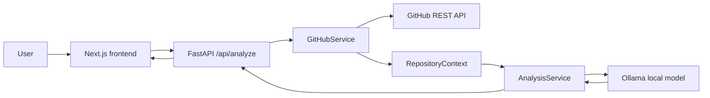

# RepoLens

RepoLens is an AI-powered GitHub repository intelligence application. Paste a public GitHub repository URL to retrieve real repository metadata, language data, README content, and a bounded file tree, then receive structured engineering insights from a local Ollama model.

## What It Does

- Validates public GitHub repository URLs without fetching arbitrary websites.
- Retrieves repository metadata, language breakdown, README, and recursive file tree through GitHub's REST API.
- Bounds README and file-tree content before it reaches the model, so very large repositories remain safe to analyze.
- Generates typed engineering insights: executive summary, technologies, architecture, components, folder responsibilities, and improvements.
- Displays retrieved GitHub facts separately from the AI analysis.

## Architecture



The backend keeps responsibilities separate:

```text
API route → GitHubService → RepositoryContext → AnalysisService → Pydantic response
```

## Tech Stack

- Frontend: Next.js 14, React, TypeScript, Tailwind CSS
- Backend: FastAPI, Pydantic, HTTPX
- Repository data: GitHub REST API
- AI: Ollama-compatible local model
- Testing: Pytest with mocked GitHub and Ollama responses

## How It Works

1. The user submits a URL such as `https://github.com/vercel/next.js`.
2. FastAPI validates and parses the owner and repository name.
3. `GitHubService` retrieves real repository metadata, languages, README, and file-tree entries.
4. The service creates a bounded `RepositoryContext`:
   - README is limited to 20,000 characters.
   - File tree is limited to 500 entries.
5. `AnalysisService` supplies that context to Ollama in JSON mode, then validates the result with Pydantic.
6. The frontend displays the repository facts and the structured engineering analysis.

## Local Development

### Prerequisites

- Python 3.11 or newer
- Node.js 20 or newer
- [Ollama](https://ollama.com/) running locally

### 1. Start Ollama

In one PowerShell terminal:

```powershell
ollama pull llama3.2:1b
ollama serve
```

If Ollama is already running as a desktop service, only the `ollama pull` command is needed.

### 2. Start the backend

In a second PowerShell terminal:

```powershell
cd C:\Users\insik\Downloads\projects\repo-lens\backend
python -m venv .venv
.\.venv\Scripts\Activate.ps1
pip install -r requirements.txt
Copy-Item .env.example .env
uvicorn src.main:app --reload --port 8000
```

### 3. Start the frontend

In a third PowerShell terminal:

```powershell
cd C:\Users\insik\Downloads\projects\repo-lens\frontend
Copy-Item .env.local.example .env.local
npm ci
npm run dev
```

Open [http://localhost:3000](http://localhost:3000), then analyze a public repository such as:

```text
https://github.com/vercel/next.js
```

## Environment Variables

Backend variables are loaded from `backend/.env`.

| Variable | Required | Default | Purpose |
| --- | --- | --- | --- |
| `GITHUB_TOKEN` | No | — | Raises GitHub API rate limits for public repositories. Never expose this to the frontend. |
| `OLLAMA_BASE_URL` | No | `http://localhost:11434` | Ollama API address. |
| `OLLAMA_MODEL` | No | `llama3.2:1b` | Local model used for analysis. |
| `ANALYSIS_TIMEOUT_SECONDS` | No | `120` | Maximum total time allowed for one model analysis. |

Frontend variables are loaded from `frontend/.env.local`.

| Variable | Required | Default | Purpose |
| --- | --- | --- | --- |
| `NEXT_PUBLIC_API_BASE_URL` | No | `http://127.0.0.1:8000` | Backend API base URL. |

## Testing

Run backend tests without a live GitHub or Ollama server:

```powershell
cd C:\Users\insik\Downloads\projects\repo-lens\backend
.\.venv\Scripts\python.exe -m pytest -q tests -p no:cacheprovider
```

Type-check the frontend:

```powershell
cd C:\Users\insik\Downloads\projects\repo-lens\frontend
npx tsc --noEmit
```

## Future Roadmap

- Persist analysis history after selecting an appropriate database workflow.
- GitHub OAuth for private repository access.
- Repository chat and source-aware retrieval.
- Pull-request and commit analysis.
- Specialized security, quality, and documentation insights.

These are intentionally outside the current repository-intelligence MVP.
