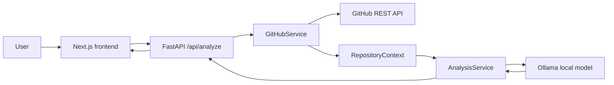

# RepoLens

RepoLens is an AI-powered GitHub repository intelligence application. Paste a public GitHub repository URL to retrieve real repository metadata, language data, README content, and a bounded file tree, then receive structured engineering insights from Groq or a local Ollama model.

## What It Does

- Validates public GitHub repository URLs without fetching arbitrary websites.
- Retrieves repository metadata, language breakdown, README, and recursive file tree through GitHub's REST API.
- Bounds README and file-tree content before it reaches the model, so very large repositories remain safe to analyze.
- Generates typed engineering insights: executive summary, technologies, architecture, components, folder responsibilities, and improvements.
- Displays retrieved GitHub facts separately from the AI analysis.

## Architecture



The backend keeps responsibilities separate:

```text
API route → GitHubService → RepositoryContext → AnalysisService → Pydantic response
```

## Tech Stack

- Frontend: Next.js 14, React, TypeScript, Tailwind CSS
- Backend: FastAPI, Pydantic, HTTPX
- Repository data: GitHub REST API
- AI: Groq (hosted) or Ollama-compatible local model
- Testing: Pytest with mocked GitHub and Ollama responses

## How It Works

1. The user submits a URL such as `https://github.com/vercel/next.js`.
2. FastAPI validates and parses the owner and repository name.
3. `GitHubService` retrieves real repository metadata, languages, README, and file-tree entries.
4. The service creates a bounded `RepositoryContext`:
   - README is limited to 20,000 characters.
   - File tree is limited to 500 entries.
5. `AnalysisService` supplies that context to Ollama in JSON mode, then validates the result with Pydantic.
6. The frontend displays the repository facts and the structured engineering analysis.

## Local Development

### Prerequisites

- Python 3.11 or newer
- Node.js 20 or newer
- [Ollama](https://ollama.com/) running locally

### 1. Start Ollama

In one PowerShell terminal:

```powershell
ollama pull llama3.2:1b
ollama serve
```

If Ollama is already running as a desktop service, only the `ollama pull` command is needed.

### 2. Start the backend

In a second terminal (PowerShell or bash):

Windows (PowerShell):

```powershell
cd backend
python -m venv .venv
.\.venv\Scripts\Activate.ps1
pip install -r requirements.txt
Copy-Item .env.example .env
uvicorn src.main:app --reload --port 8000
```

macOS / Linux (bash):

```bash
cd backend
python3 -m venv .venv
source .venv/bin/activate
pip install -r requirements.txt
cp .env.example .env
uvicorn src.main:app --reload --port 8000
```

### 3. Start the frontend

In a third terminal (PowerShell or bash):

Windows (PowerShell):

```powershell
cd frontend
Copy-Item .env.local.example .env.local
npm ci
npm run dev
```

macOS / Linux (bash):

```bash
cd frontend
cp .env.local.example .env.local
npm ci
npm run dev
```

Open http://localhost:3000 in your browser, then analyze a public repository such as:

```text
https://github.com/vercel/next.js
```

## Environment Variables

Backend variables are loaded from `backend/.env`.

| Variable | Required | Default | Purpose |
| --- | --- | --- | --- |
| `GITHUB_TOKEN` | No | — | Raises GitHub API rate limits for public repositories. Never expose this to the frontend. |
| `AI_PROVIDER` | No | auto-detect | Set to `groq`, `openai`, or `ollama`. Use `groq` for the hosted free-tier setup. |
| `GROQ_API_KEY` | Groq only | — | Groq API key. Store it only in the backend host's secret environment variables. |
| `GROQ_MODEL` | No | `openai/gpt-oss-20b` | Groq model used for analysis. |
| `OLLAMA_BASE_URL` | No | `http://localhost:11434` | Ollama API address. |
| `OLLAMA_MODEL` | No | `llama3.2:1b` | Local model used for analysis. |
| `ANALYSIS_TIMEOUT_SECONDS` | No | `120` | Maximum total time allowed for one model analysis. |

Frontend variables are loaded from `frontend/.env.local`.

| Variable | Required | Default | Purpose |
| --- | --- | --- | --- |
| `NEXT_PUBLIC_API_BASE_URL` | No | `http://127.0.0.1:8000` | Backend API base URL. |

## Deployment: Vercel + Render

RepoLens deploys as two public-facing applications:

```text
Vercel (Next.js frontend) → Render (FastAPI API) → Render private Ollama service
```

The production deployment uses Groq's hosted API. The included `render.yaml` defines only the FastAPI service on Render's free plan; it does not run Ollama or need a persistent disk. Groq's free tier has request and token limits, so it is suitable for a personal portfolio project rather than unlimited production traffic.

### 1. Push this project to GitHub

Commit and push this project to the repository you want to deploy. Do not commit `.env`, `.env.local`, `.venv`, or `node_modules`.

### 2. Deploy the backend on Render

1. In Render, select **New → Web Service** and connect the GitHub repository.
2. Set the Root Directory to `backend`, choose Docker, and select the free instance type.
3. Add these environment variables:

   ```text
   AI_PROVIDER=groq
   GROQ_API_KEY=<your Groq secret key>
   GROQ_MODEL=openai/gpt-oss-20b
   CORS_ORIGINS=https://<your-vercel-project>.vercel.app
   GITHUB_TOKEN=<optional GitHub token>
   ```

4. Deploy, then confirm `https://<your-api-name>.onrender.com/health` returns `{"status":"ok"}`.

### Legacy Ollama Blueprint instructions (not used for the free Groq deployment)

1. In Render, select **New → Blueprint** and connect the GitHub repository.
2. Render discovers the root-level `render.yaml` and creates:
   - `repolens-api`, the public FastAPI web service
   - `repolens-ollama`, a private Ollama service with persistent model storage
3. When prompted, set:
   - `GITHUB_TOKEN` (recommended; optional for public repositories)
   - `CORS_ORIGINS` temporarily to your expected Vercel production URL, then update it after Vercel creates the final URL.
4. Wait for `repolens-ollama` to finish downloading `llama3.2:1b`, then confirm `https://<your-api-name>.onrender.com/health` returns `{"status":"ok"}`.

### 3. Deploy the frontend on Vercel

1. In Vercel, import the same GitHub repository.
2. Set **Root Directory** to `frontend`.
3. Add this production environment variable before deploying:

   ```text
   NEXT_PUBLIC_API_BASE_URL=https://<your-api-name>.onrender.com
   ```

4. Deploy. Vercel detects Next.js automatically.
5. Copy the resulting Vercel URL and update the Render API service's `CORS_ORIGINS` value to that exact URL. Add your custom domain too if you use one, separated with commas.

For local development, set `AI_PROVIDER=ollama` and use the Ollama settings in `backend/.env.example`.

## Testing

Run backend tests without a live GitHub or Ollama server (from the repository root):

Windows (PowerShell):

```powershell
cd backend
.\.venv\Scripts\python.exe -m pytest -q tests -p no:cacheprovider
```

macOS / Linux (bash):

```bash
cd backend
source .venv/bin/activate
python -m pytest -q tests -p no:cacheprovider
```

Type-check the frontend (from the `frontend` folder):

```bash
cd frontend
npx tsc --noEmit
```

## Future Roadmap

- Persist analysis history after selecting an appropriate database workflow.
- GitHub OAuth for private repository access.
- Repository chat and source-aware retrieval.
- Pull-request and commit analysis.
- Specialized security, quality, and documentation insights.

These are intentionally outside the current repository-intelligence MVP.
